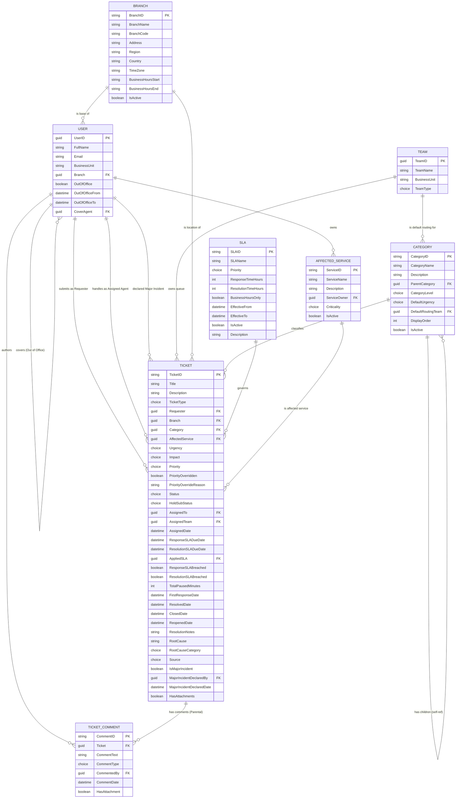

# Section 7 — Entity Relationship Diagram

## What This Section Delivers

The Entity Relationship Diagram (ERD) is the **data architecture blueprint** for the solution I designed. Every requirement I wrote in Section 5 must be supported by a place to store its data. Every acceptance criterion I wrote in Section 6 must be verifiable against actual records. The ERD is where these abstract requirements meet concrete data structures.

This section delivers four things:

1. **Conceptual learning** — what acceptance criteria are, the different types of relationships, and data types (per the cohort's Key Deliverables instruction)
2. **Entity identification** — the tables this solution requires, with rationale for each
3. **Detailed table specifications** — every column, data type, required flag, and description
4. **Relationship specifications** — the connections between tables with cardinality and behaviour

By the end, you'll have the complete data model for TechCare's IT Support Ticketing System.

---

## Conceptual Learning Block

The cohort instruction explicitly calls out three concepts I needed to demonstrate fluency in: what acceptance criteria are, the different types of relationships, and data types. I'm covering each with consulting-grade precision so the rest of this section reads correctly.

---

### Concept 1 — Acceptance Criteria (Brief Recap)

I covered acceptance criteria in detail in Section 6, but to summarise the concept here:

**Acceptance Criteria** are the testable conditions that prove a requirement has been delivered correctly. They convert *"the system shall do X"* into *"here is exactly how we will verify X is happening."*

Two formats are used together:

- **Scenario-based (Given-When-Then)** — for behaviour, workflows, and user actions. Reads like a story: starting state → triggering action → expected outcome.
- **Rule-based (Checklist)** — for data rules, validation, and configuration. Reads like a contract: a list of testable conditions, each of which must be true.

Acceptance criteria must be **SMART**: Specific, Measurable, Achievable, Relevant, Time-bound. They are the contract of completion. A successful walkthrough of acceptance criteria with the client is called **User Acceptance Testing (UAT)** and is the milestone that moves a project from build to go-live.

I produced 199 acceptance criteria across all 64 requirements in Section 6 — full coverage, no sampling.

---

### Concept 2 — Relationship Types

A **relationship** describes how records in one table connect to records in another. Three types of relationships exist in any relational data model, including Dataverse:

#### One-to-Many (1:N)

One record in Table A is associated with many records in Table B, but each record in Table B belongs to only one record in Table A.

> *Example:* One Category can classify many Tickets. Each Ticket has only one Category.

This is by far the most common relationship type and the one most relevant to my model.

#### Many-to-One (N:1)

The mirror image of 1:N. From Table B's perspective, many records belong to one record in Table A. In Dataverse, when you create a 1:N relationship, the N:1 view comes for free — they are the same relationship, viewed from opposite ends.

> *Example:* Many Tickets relate to one Category.

#### Many-to-Many (N:N)

One record in Table A can be associated with many records in Table B, and vice versa. This requires a *junction table* in the background to track the associations.

> *Example (hypothetical):* One Ticket could be tagged with many Skills, and one Skill could apply to many Tickets.

In my Phase 1 design, I used only 1:N relationships. Many-to-many introduces complexity that Phase 1 does not require.

#### Self-Referencing Relationship (special case of 1:N)

A table can have a relationship to *itself*. This is how I modelled hierarchies: a row points to another row in the same table as its parent.

> *Example:* My Category table is self-referencing — a Sub-Category row points to its Parent Category row, both rows in the same table.

This is the **adjacency list pattern** — a standard technique for storing hierarchical data without needing separate tables for each level.

---

### Relationship Behaviours

When you create a relationship in Dataverse, you also configure how it *behaves* when records are deleted, assigned, or shared. Three behaviours mattered for my design:

#### Parental

The child record fully inherits the parent's life cycle. When the parent is deleted, all children are automatically deleted with it. I used this when the child cannot exist meaningfully without the parent.

> *Example:* Ticket Comment is parental to Ticket. If a Ticket is deleted, its Comments must go too — they have no meaning on their own.

#### Referential

The child record exists independently. When the parent is deleted, the child remains; its lookup field simply becomes blank.

> *Example:* User to Ticket (Requester). If a User leaves the organisation and is deactivated, their tickets remain for audit purposes — the Requester field may be retained or cleared, depending on policy.

#### Referential, Restrict Delete

Like Referential, but the parent cannot be deleted at all if any child still references it. The deletion is blocked until the references are removed or reassigned.

> *Example:* Category to Ticket. You should not be able to delete the "Hardware" category while any active tickets are still classified as Hardware. Deactivation is allowed; deletion is not.

Choosing the right behaviour for each relationship is a design decision that protects data integrity.

---

### Concept 3 — Data Types

A **data type** specifies what kind of value a column can hold. Choosing the right data type is foundational to data quality, performance, and reporting. The data types most relevant to my model:

| Data Type | Purpose | Example Use in My Design |
|---|---|---|
| **Single Line of Text** | Short string, typically up to 100–200 characters | Ticket Title, Branch Code |
| **Multiple Lines of Text** | Longer string, supports line breaks | Ticket Description, Resolution Notes |
| **Whole Number (Integer)** | Numeric value with no decimal point | Response Time Hours, Resolution Time Hours |
| **Date and Time** | Timestamp, time-zone aware | Created On, SLA Due Date |
| **Yes/No (Boolean)** | Two-value field | Is Active, SLA Breached |
| **Choice (Option Set)** | Controlled list of predefined values | Priority, Status, Urgency, Impact |
| **Lookup** | Reference to a row in another table | Requester, Category, Assigned To |
| **Email** | Text with email format validation | User email |
| **Autonumber** | System-generated unique sequential identifier | Ticket reference (`INC-YYYY-NNNNNN`) |
| **File** | Stored attachment with size and type controls | Ticket attachments |
| **Calculated** | Derived from other fields | Priority calculated from Urgency × Impact |

Choosing the right data type matters for:

- **Validation** — reject bad data at entry
- **Performance** — indexed lookups vs. text searches
- **Reporting** — numeric aggregation, date filtering
- **Integrity** — references that cannot break

---

## My Four-Phase Design Method

I used the same disciplined approach a senior data architect would: **Identify, Specify, Connect, Refine.**

**Phase 1 — Identify the Entities.** I read through the requirements and underlined the significant nouns. Then I decided which of those nouns warranted their own table.

**Phase 2 — Specify Attributes.** For each entity, I defined every column, with data type and required flag.

**Phase 3 — Establish Relationships.** I defined how entities connect, with cardinality and behaviour.

**Phase 4 — Normalise and Refine.** I eliminated redundancy. Ensured every piece of information lives in exactly one place.

---

## Phase 1 — Entity Identification

Reviewing the 64 requirements, the significant nouns that emerged were:

| Candidate Noun | Decision | Rationale |
|---|---|---|
| Ticket | **Custom Table** | The central transactional entity |
| Category (with hierarchy) | **Custom Table** (self-referencing) | Multi-level taxonomy must be configurable |
| SLA | **Custom Table** | Versioned policies with multiple attributes |
| Ticket Comment | **Custom Table** | Multiple per ticket; needs author and type |
| Branch / Location | **Custom Table** | Reusable across tickets and users; supports reporting |
| Affected Service | **Custom Table** | Phase 1 list; foundation for Phase 2 Service Catalog |
| User | **Built-in Table** | Use Dataverse's built-in User table |
| Team | **Built-in Table** | Use Dataverse's built-in Team table |
| Status, Urgency, Impact, Priority | Choice columns on Ticket | Stable lists, no extra attributes needed |
| Source, Hold Sub-Status, Comment Type | Choice columns | Stable lists |
| Attachment | Built-in Dataverse File column | Use platform-native handling |
| Audit Log | Built-in Dataverse Auditing | Use platform-native auditing |

**My final entity list:**

1. **Ticket** (custom — core transactional)
2. **Category** (custom — self-referencing for hierarchy)
3. **SLA** (custom — versioned policy records)
4. **Ticket Comment** (custom — supporting transactional)
5. **Branch / Location** (custom — reference data)
6. **Affected Service** (custom — reference data)
7. **User** (built-in Dataverse `systemuser` table)
8. **Team** (built-in Dataverse `team` table)

---

## Phase 2 — Table Specifications

Each table specification below shows: column name, data type, required flag, and description.

System columns (Created On, Created By, Modified On, Modified By, Owner) are present on every Dataverse table automatically and are not repeated in every specification.

---

### Table 1: Ticket

The central entity. Every ticket — incident or service request — is one row in this table.

| Column Name | Data Type | Required | Description |
|---|---|---|---|
| TicketID | Autonumber | Yes (system) | Unique reference (`INC-YYYY-NNNNNN` or `SR-YYYY-NNNNNN`); Primary Key |
| Title | Single Line of Text (max 200) | Yes | Short summary; Primary Name column |
| Description | Multiple Lines of Text (max 4000) | Yes | Full description of the issue or request |
| TicketType | Choice (Incident, Service Request) | Yes | Distinguishes incidents from service requests |
| Requester | Lookup → User | Yes | The user who submitted the ticket |
| Branch | Lookup → Branch | Yes | The location the ticket relates to |
| Category | Lookup → Category | Yes | The deepest-level category selected (Level 1, 2, or 3) |
| AffectedService | Lookup → Affected Service | No | The IT service affected (where applicable) |
| Urgency | Choice (Critical, High, Medium, Low) | Yes | User-selected urgency |
| Impact | Choice (Whole Org, Entire Dept, Whole Branch, Only Me) | Yes | User-selected impact |
| Priority | Choice (P1, P2, P3, P4) | Yes (calculated) | Calculated from Urgency × Impact via ITIL matrix |
| PriorityOverridden | Yes/No | No | Flag indicating manual priority override |
| PriorityOverrideReason | Multiple Lines of Text | No | Reason supplied for manual override |
| Status | Choice (New, Assigned, In Progress, On Hold, Resolved, Closed, Reopened) | Yes | Current lifecycle status |
| HoldSubStatus | Choice (Awaiting User, Awaiting Vendor, Awaiting Parts, Awaiting Approval) | Conditional | Required when Status = On Hold |
| AssignedTo | Lookup → User | No | The agent currently assigned to the ticket |
| AssignedTeam | Lookup → Team | No | The queue/team currently owning the ticket |
| AssignedDate | Date and Time | No | Timestamp of most recent assignment |
| ResponseSLADueDate | Date and Time | Yes (calculated) | Calculated due time for first response |
| ResolutionSLADueDate | Date and Time | Yes (calculated) | Calculated due time for resolution |
| AppliedSLA | Lookup → SLA | Yes | The SLA record in effect at ticket creation |
| ResponseSLABreached | Yes/No | No | Flag set when Response SLA passes without response |
| ResolutionSLABreached | Yes/No | No | Flag set when Resolution SLA passes without resolution |
| TotalPausedMinutes | Whole Number | No | Cumulative time spent in SLA-pausing statuses |
| FirstResponseDate | Date and Time | No | Timestamp of first agent response |
| ResolvedDate | Date and Time | No | Timestamp of resolution |
| ClosedDate | Date and Time | No | Timestamp of closure |
| ReopenedDate | Date and Time | No | Timestamp of most recent reopen |
| ResolutionNotes | Multiple Lines of Text (min 30 chars at resolution) | Conditional | Description of how the ticket was resolved |
| RootCause | Multiple Lines of Text (min 50 chars for P1/P2) | Conditional | Root cause analysis (mandatory for P1/P2) |
| RootCauseCategory | Choice (Hardware Failure, Software Defect, Configuration Error, User Error, Process Gap, Third-Party Issue, Pending Investigation) | Conditional | Categorical root cause classification |
| Source | Choice (Web Portal, Email, Phone, Walk-up, Chatbot) | Yes | Intake channel; auto-set; not user-editable |
| IsMajorIncident | Yes/No | No | Flag for Major Incident handling |
| MajorIncidentDeclaredBy | Lookup → User | No | Who declared the Major Incident |
| MajorIncidentDeclaredDate | Date and Time | No | When the Major Incident was declared |
| HasAttachments | Yes/No (calculated) | No | Quick indicator of attachment presence |

System columns automatically present: Created On, Created By, Modified On, Modified By, Owner.

---

### Table 2: Category

Self-referencing table supporting three levels of hierarchy.

| Column Name | Data Type | Required | Description |
|---|---|---|---|
| CategoryID | Autonumber | Yes (system) | Unique identifier; Primary Key |
| CategoryName | Single Line of Text (max 100) | Yes | The name of the category; Primary Name column |
| Description | Multiple Lines of Text | No | Optional description of what this category covers |
| ParentCategory | Lookup → Category (self) | No | Points to parent category; blank for Level 1 categories |
| CategoryLevel | Choice (Level 1, Level 2, Level 3) | Yes | Position in the hierarchy |
| DefaultUrgency | Choice (Critical, High, Medium, Low) | No | Suggested default urgency for tickets in this category |
| DefaultRoutingTeam | Lookup → Team | No | Default queue tickets in this category route to |
| DisplayOrder | Whole Number | No | Sort order within siblings |
| IsActive | Yes/No | Yes | Controls whether the category appears in selection dropdowns |

---

### Table 3: SLA

Versioned policy records. Each Priority level has its own SLA record. Versioning supports historical reporting accuracy.

| Column Name | Data Type | Required | Description |
|---|---|---|---|
| SLAID | Autonumber | Yes (system) | Unique identifier; Primary Key |
| SLAName | Single Line of Text (max 100) | Yes | Name of the SLA policy; Primary Name column |
| Priority | Choice (P1, P2, P3, P4) | Yes | The priority this SLA applies to |
| ResponseTimeHours | Whole Number | Yes | Required first-response time in hours |
| ResolutionTimeHours | Whole Number | Yes | Required resolution time in hours |
| BusinessHoursOnly | Yes/No | Yes | Whether SLA timer counts only business hours |
| EffectiveFrom | Date and Time | Yes | Start of the period this SLA is in effect |
| EffectiveTo | Date and Time | No | End of the period (blank means currently active) |
| IsActive | Yes/No | Yes | Whether this SLA is currently in use |
| Description | Multiple Lines of Text | No | Notes on the policy |

---

### Table 4: Ticket Comment

Supporting transactional table. Each ticket can have many comments. Comments capture the conversation history and the resolution narrative.

| Column Name | Data Type | Required | Description |
|---|---|---|---|
| CommentID | Autonumber | Yes (system) | Unique identifier; Primary Key |
| Ticket | Lookup → Ticket | Yes | The ticket this comment belongs to (Parental relationship) |
| CommentText | Multiple Lines of Text | Yes | The body of the comment |
| CommentType | Choice (Internal Note, Customer Update, Resolution) | Yes | Determines visibility and notification behaviour |
| CommentedBy | Lookup → User | Yes | Who authored the comment |
| CommentDate | Date and Time | Yes | When the comment was created |
| HasAttachment | Yes/No | No | Indicator of attachment presence |

---

### Table 5: Branch / Location

Reference data table. Each ticket and each user is associated with a branch.

| Column Name | Data Type | Required | Description |
|---|---|---|---|
| BranchID | Autonumber | Yes (system) | Unique identifier; Primary Key |
| BranchName | Single Line of Text (max 100) | Yes | Display name (e.g., "OGBA - B05"); Primary Name column |
| BranchCode | Single Line of Text (max 20) | Yes | Short code (e.g., "OGBA-B05") |
| Address | Multiple Lines of Text | No | Physical address |
| Region | Single Line of Text (max 100) | No | Geographic grouping |
| Country | Single Line of Text (max 100) | No | Country of operation |
| TimeZone | Single Line of Text (max 50) | No | Local time zone (e.g., "Africa/Lagos") |
| BusinessHoursStart | Single Line of Text | No | e.g., "07:00" |
| BusinessHoursEnd | Single Line of Text | No | e.g., "19:00" |
| IsActive | Yes/No | Yes | Whether the branch is currently operational |

---

### Table 6: Affected Service

Reference data — the IT services known to the organisation. Phase 1 list; Phase 2 expands to a full Service Catalog.

| Column Name | Data Type | Required | Description |
|---|---|---|---|
| ServiceID | Autonumber | Yes (system) | Unique identifier; Primary Key |
| ServiceName | Single Line of Text (max 100) | Yes | Name of the service (e.g., "Email", "Core Banking"); Primary Name column |
| Description | Multiple Lines of Text | No | What the service provides |
| ServiceOwner | Lookup → User | No | Person accountable for the service |
| Criticality | Choice (Tier 1, Tier 2, Tier 3) | No | Business criticality classification |
| IsActive | Yes/No | Yes | Whether the service is currently available |

---

### Table 7: User (Built-in `systemuser`)

Native Dataverse table. I did not create this; I referenced it. Relevant attributes for my model:

| Column Name | Notes |
|---|---|
| UserID | System-generated unique identifier |
| FullName | The user's full name |
| Email | Primary email address |
| BusinessUnit | The user's business unit |
| Branch | (Custom column added by me) Lookup → Branch — the user's home branch |
| OutOfOffice | (Custom column) Yes/No — out-of-office indicator |
| OutOfOfficeFrom | (Custom column) Date and Time |
| OutOfOfficeTo | (Custom column) Date and Time |
| CoverAgent | (Custom column) Lookup → User — designated cover during OoO |
| (Many other built-in columns) | Roles, license, etc. |

---

### Table 8: Team (Built-in `team`)

Native Dataverse table for representing groups (queues). Used to model L1 queues, L2 specialist queues, and L3 teams.

| Column Name | Notes |
|---|---|
| TeamID | System-generated unique identifier |
| TeamName | The team's name (e.g., "L1 Service Desk", "L2 Network Specialists") |
| BusinessUnit | The owning business unit |
| TeamType | Built-in classification |

---

## Phase 3 — Relationships

Each relationship below specifies parent table, child table, type, behaviour, and rationale.

| # | Parent Table | Child Table | Lookup Column on Child | Type | Behaviour | Rationale |
|---|---|---|---|---|---|---|
| 1 | User | Ticket | Requester | 1:N | Referential | One user submits many tickets; tickets persist if user departs |
| 2 | User | Ticket | AssignedTo | 1:N | Referential | One agent handles many tickets; tickets persist if agent departs |
| 3 | User | Ticket | MajorIncidentDeclaredBy | 1:N | Referential | Audit retention of declarer |
| 4 | Team | Ticket | AssignedTeam | 1:N | Referential | One team owns many tickets |
| 5 | Branch | Ticket | Branch | 1:N | Referential, Restrict Delete | Cannot delete a branch with associated tickets |
| 6 | Category | Ticket | Category | 1:N | Referential, Restrict Delete | Cannot delete a category with associated tickets |
| 7 | Category | Category | ParentCategory | 1:N (self-ref) | Referential, Restrict Delete | Cannot delete a parent category with children |
| 8 | SLA | Ticket | AppliedSLA | 1:N | Referential, Restrict Delete | Tickets must retain reference to the SLA in effect |
| 9 | Affected Service | Ticket | AffectedService | 1:N | Referential, Restrict Delete | Cannot delete a service with associated tickets |
| 10 | Ticket | Ticket Comment | Ticket | 1:N | **Parental** | Comments cannot exist without parent ticket — cascade delete |
| 11 | User | Ticket Comment | CommentedBy | 1:N | Referential | Comments persist if author departs |
| 12 | Branch | User | Branch | 1:N | Referential | Each user has a home branch |
| 13 | User | Affected Service | ServiceOwner | 1:N | Referential | Each service has an owner |
| 14 | User | User | CoverAgent | 1:N (self-ref) | Referential | Out-of-office cover assignment |
| 15 | Team | Category | DefaultRoutingTeam | 1:N | Referential | Default routing target for a category |

---

## Phase 4 — Normalisation and Design Rationale

My design follows the principle: **every piece of information lives in exactly one place.**

### Things I deliberately avoided

- **Storing names alongside IDs.** I did not store `RequesterName`, `AssignedToName`, or `CategoryName` on the Ticket table. The lookup retrieves the current name from the User or Category table at display time. This prevents stale data after a name change.

- **Duplicating SLA values on the ticket.** I store only the SLA record reference and the calculated due dates. Response/Resolution time-in-hours stays in the SLA table.

- **Inventing structures the platform already provides.** I used the built-in User table, Team table, File handling, Auditing, and Owner column rather than re-creating them.

- **Many-to-many relationships.** Phase 1 has none. Where a ticket relates to one entity (one Category, one Branch, one Requester), I used 1:N. If Phase 2 introduces tags, skills, or shared ownership, those will be N:N.

### Things I deliberately did include

- **Redundant flags for performance** like `ResponseSLABreached` and `ResolutionSLABreached` on Ticket. These are technically derivable from due dates and current status, but storing the flag enables fast filtering in views without recalculating per row. This is a normalisation compromise I made for operational performance, and it is an acceptable trade-off because the flag is system-maintained, not user-editable.

- **Audit columns** (Created By, Modified By, etc.) are platform-provided and I used them rather than reinventing. I supplemented with explicit Resolution Notes, Root Cause, and other domain-specific history fields.

- **Categorical Root Cause** alongside free-text Root Cause. The category enables reporting; the free text provides detail.

---

## The ERD as Mermaid

For visual reference, here is the model expressed as a Mermaid ER diagram. This code can be pasted into [mermaid.live](https://mermaid.live) or any Mermaid-enabled editor to render the diagram.

GitHub will render this Mermaid code block as an interactive diagram automatically. No external tool is required to view it.

---

## Model Summary

| Item | Count |
|---|---|
| Custom tables | 6 (Ticket, Category, SLA, Ticket Comment, Branch, Affected Service) |
| Built-in tables referenced | 2 (User, Team) |
| Total entities in model | 8 |
| Total relationships | 15 |
| Self-referencing relationships | 2 (Category, User-CoverAgent) |
| Parental relationships | 1 (Ticket → Ticket Comment) |
| Restrict Delete relationships | 5 (Branch, Category, Category self-ref, SLA, Affected Service) |

---

## Why This Section Matters

This data model is the **physical foundation** of every functional requirement in Section 5 and every acceptance criterion in Section 6. Every test case that gets written must verify behaviour against records in these tables. Every report executive leadership requests must be answerable from these structures.

A well-designed data model is invisible when it works and devastating when it doesn't. Get it right at design time, and the rest of the implementation flows naturally. Get it wrong, and every subsequent feature fights the structure.

The model above reflects:

- **ITIL alignment** — Incident vs. Service Request distinction, formal Priority calculation, Root Cause capture, Major Incident handling
- **Regulated enterprise patterns** — full audit trail readiness, separation of duties, immutable references, retention support
- **Real-world depth** — multi-level categorisation, branch awareness, OoO coverage, paused-time tracking, SLA versioning
- **Phase 1 scope discipline** — capabilities included only where they directly serve Phase 1 requirements; deeper structures (CMDB, Problem records, Change records) deferred

This is what a production-grade ITSM data model looks like. My submission stands at this level.

---

⬅️ **Previous:** [Section 6 — Acceptance Criteria](../06-Acceptance-Criteria)
🏠 **Back to Project Overview:** [Main README](../README.md)
